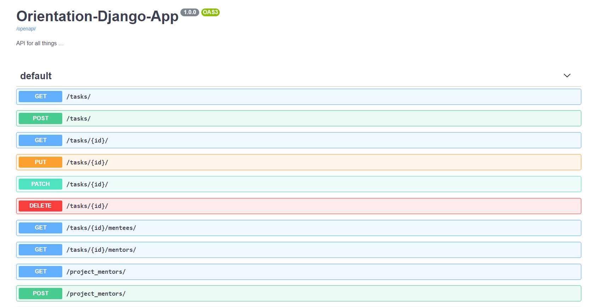
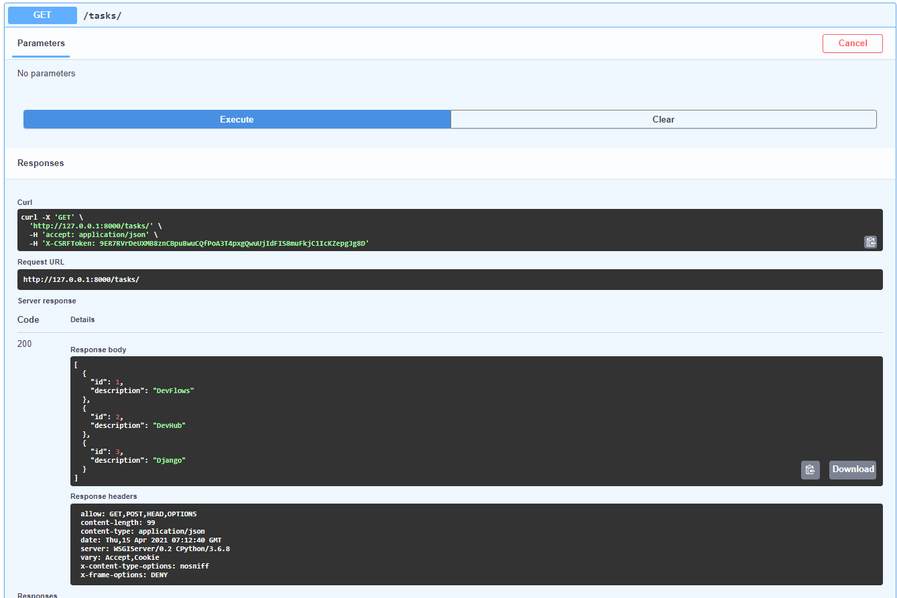
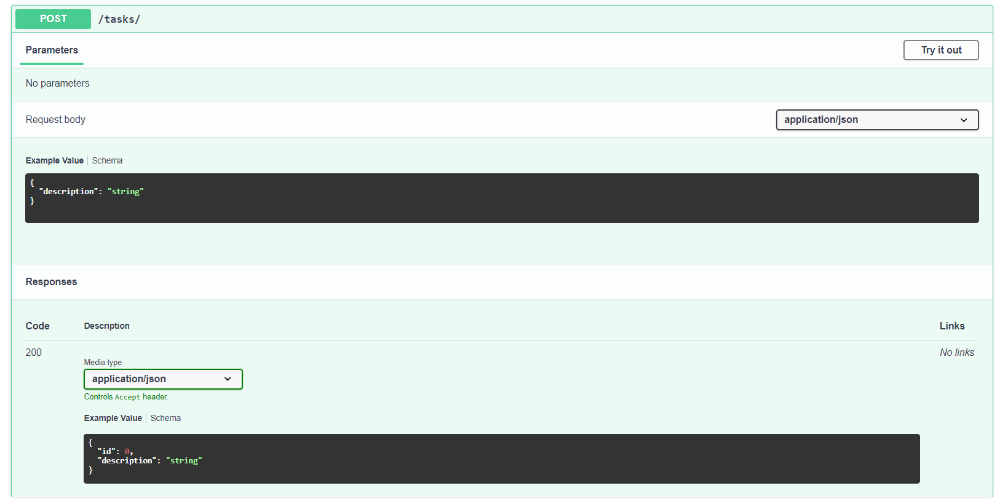

# Orientation-Django-App

A dockerized application that provides all the essential API endpoints required for an orientation of freshers/interns in a company.

It supports adding Tasks, Mentees and Mentors for the Orientation program. Also, we can assign a task to a mentee or mentee to a mentor. `ModelViewSet` has been used to create models which helps create RESTful APIs supporting all CRUD operations. 

It also supports some basic query requirements such as: 
- Get Mentees assigned to the given Mentor ID
- Get all projects being supervised by the given Mentor ID
- Get all mentees and mentors working around the given Project ID

To run the application you can run following commands (which I would recommend to run in a virtual environment):
```bash
pip install -r requirements.txt

# Please add your own secret key in mysite/settings.py before running the server.
python manage.py runserver
```

### Swagger UI page: (Available at http://127.0.0.1:8000/swagger-ui/)


### Trying out a GET request


### Trying out a POST request



> NOTE: You might want to visit [Django Rest Framework](https://www.django-rest-framework.org/) for more insights into the codebase and the use of `ViewSet` in creating RESTful API endpoints. 